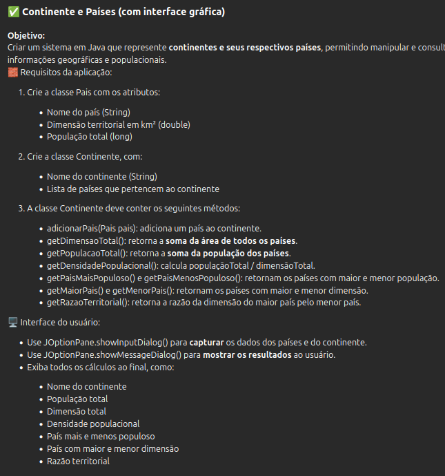

# Continente e Países (com interface gráfica)

Sobre o projeto

Esta atividade foi desenvolvido em Java com o objetivo de representar continentes e seus respectivos países, permitindo realizar cálculos e consultas sobre dados geográficos e populacionais, aplicando na prática conceitos de Programação Orientada a Objetos (POO) e polimorfismo.

A aplicação utiliza uma interface gráfica simples com JOptionPane, tornando a interação mais intuitiva, sem a necessidade de uso do terminal.

## Funcionalidades

Cadastro de continente

Cadastro de múltiplos países

Cálculo automático de:
- Dimensão total
- População total
- Densidade populacional
- País mais e menos populoso
- País com maior e menor dimensão
- Razão territorial (maior país / menor país)

# Atividade




## Como executar

1- Clone o repositório
```script 
    git clone https://github.com/FelipeDeLaraKunz/Continente-Paises-Java.git
```
2-Abra o projeto em uma IDE Java (ex: IntelliJ, Eclipse, NetBeans)

3-Execute a classe principal "Atividade2.java"
